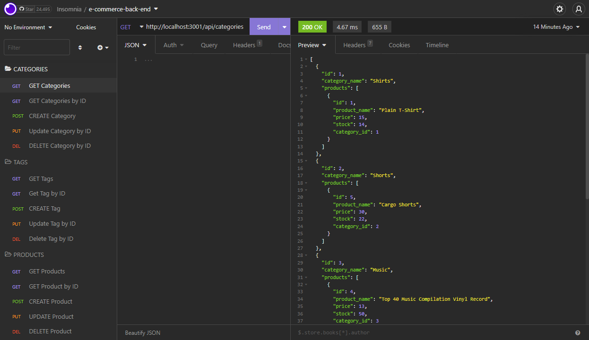

# E-commerce-back-end

## Description

This application demonstrates the backend for an e-commerce site. The ORM of choice for this project is [sequelize](https://www.npmjs.com/package/sequelize) and it allowed for more more object oriented management of the database. [Express](https://www.npmjs.com/package/express) is used to create a connection for [Insomnia Core](https://insomnia.rest/products/insomnia) to connect to (or a frontend connection to the backend in the case of future development).

https://user-images.githubusercontent.com/50060256/200092449-5f962d89-d4c7-4161-b123-6ec125c86e65.mp4

Express routes allow the user to get, create, update, and delete data from the database. This is displayed below using Insomnia Core.



Shown below is the many-to-many relationship between the Product and Tag models being made through the ProductTag model.

```js
Product.belongsToMany(Tag, {
  foreignKey: 'product_id',
  through: {
    model: ProductTag,
  } 
});

Tag.belongsToMany(Product, {
  foreignKey: 'tag_id',
  through: {
    model: ProductTag,
  }
});
```
## Technologies Used

- [Visual Studio Code](https://code.visualstudio.com/)
- [Github](https://github.com/)
- [Node JS](https://nodejs.org/dist/latest-v16.x/docs/api/)
- [Insomnia Core](https://insomnia.rest/products/insomnia)
- [express](https://www.npmjs.com/package/express)
- [sequelize](https://www.npmjs.com/package/sequelize)
- [dotenv](https://www.npmjs.com/package/dotenv)
